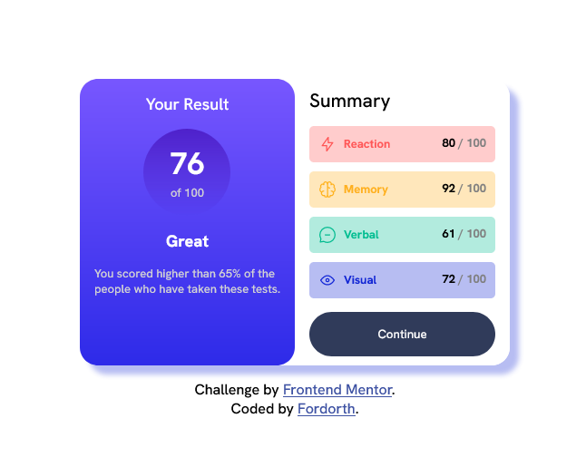

# Frontend Mentor - Results summary component solution

This is a solution to the [Results summary component challenge on Frontend Mentor](https://www.frontendmentor.io/challenges/results-summary-component-CE_K6s0maV). Frontend Mentor challenges help you improve your coding skills by building realistic projects.

## Table of contents

- [Overview](#overview)
  - [The challenge](#the-challenge)
  - [Screenshots](#screenshots)
  - [Links](#links)
- [My process](#my-process)
  - [Built with](#built-with)
  - [What I learned](#what-i-learned)
  - [Continued development](#continued-development)
  - [Useful resources](#useful-resources)
- [Author](#author)

## Overview

### The challenge

Users should be able to:

- Create a mobile and desktop view of the Results component
- See hover and focus states for all interactive elements on the page

### Screenshots

### Links

- [Solution:](https://www.frontendmentor.io/solutions/fordorths-results-summary-component-rJgeWHjM8f)
- [Live Site:](https://github.com/firebird2552/ResultsSummary)

## My process

### Built with

- Semantic HTML5 markup
- Mobile-first workflow
- Google Fonts includes
- CSS custom properties
- CSS Varialbes
- CSS Grid
- Flexbox

### What I learned

I was having issues getting the desktop site lined up properly. I was able to figure out that align-items: center; can make things look weird and for this project for the desktop view I ended up using align-items: start; which corrected the whole problem.

This is also one of the rare projects that I had to use height: fit-content; because display: flex; was forcing the parent to be smaller than the children and the background needed to be exactly the same height as the children for the box-shadow to be properly placed.

### Continued development

I decided not to use react or sass on this project so I could get back to the bascis as a large number of my projects are excessive and have features they dont need.

Through out the future I am looking to keep projects to the minimal features needed to be successful.

### Useful resources

- [W3Schools](https://www.w3scools.com) - I use this when I can remeber a certain syntax. For this project I used it for CSS Variable and linear-gradient syntax.

- [StackOverflow](https://www.stackoverflow.com) - This is an amazing resource. I looked up some stuff that was not really helpful but ended up leading me to figure out the problem on my own.

## Author

- Website - [Fordorth](https://www.github.com/firebird2552)
- Frontend Mentor - [@Firebird2552](https://www.frontendmentor.io/profile/firebird2552)
- Twitter - [@ThoGould](https://www.twitter.com/thogould)
